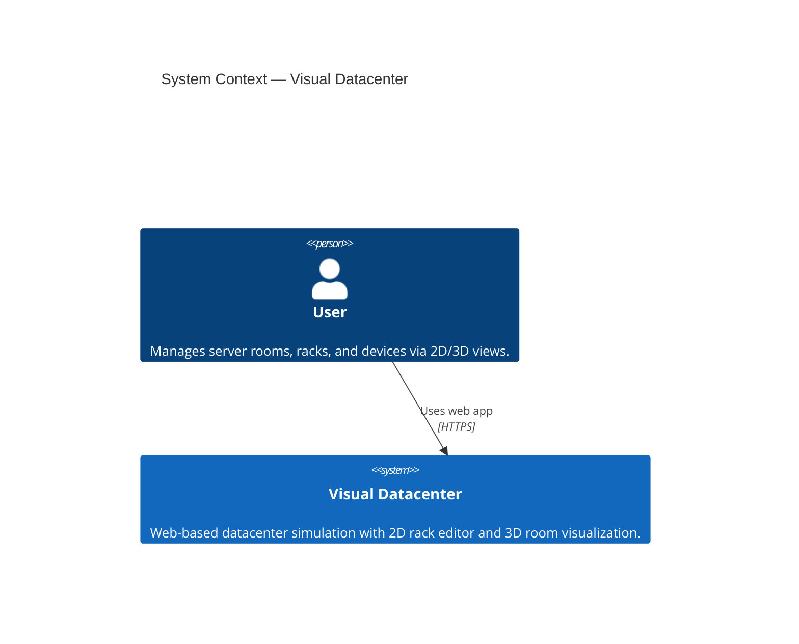
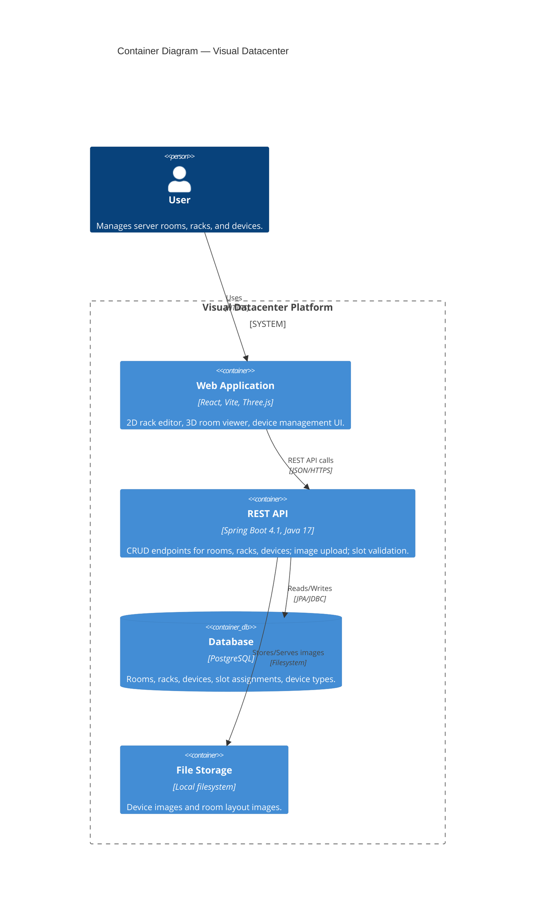
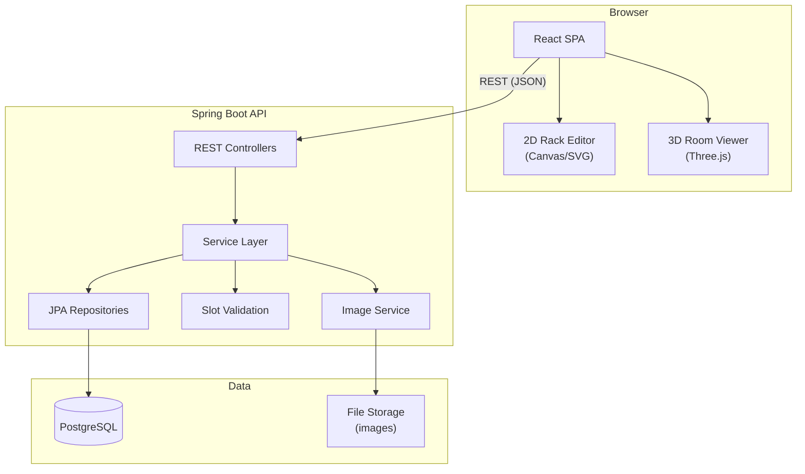
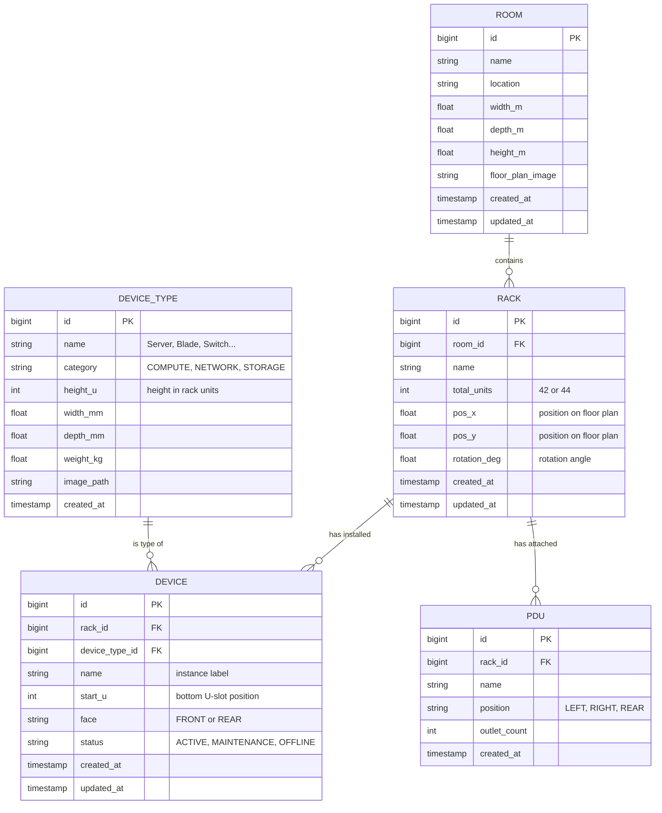
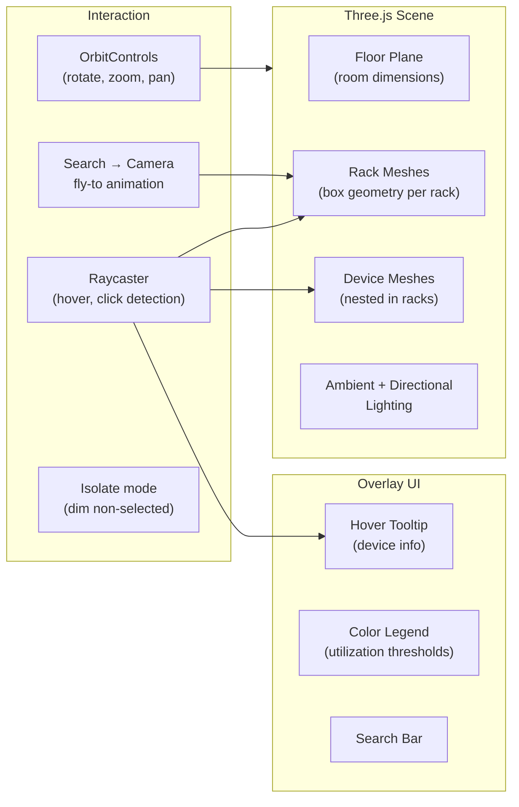

# Visual Datacenter — Technical Design

## Architectural Style

**Classic client-server** — a Spring Boot REST API serving a React SPA with Three.js for 3D rendering.

| Choice                            | Rationale                                                                                           |
| --------------------------------- | --------------------------------------------------------------------------------------------------- |
| Spring Boot 4.1 (Java 25)        | Backend already initialized; mature ecosystem for REST APIs and JPA                                 |
| PostgreSQL + JPA/Hibernate        | Relational integrity for rooms, racks, devices, and slot assignments; spatial queries if needed later |
| React + Vite SPA                  | Fast dev experience; component model fits the 2D rack editor and 3D viewer well                     |
| Three.js                          | Industry-standard WebGL library; large ecosystem of controls, loaders, and helpers                  |
| No auth / single-user sandbox     | MVP simplicity — no login, no roles; every user has full access                                     |
| Local file storage (images)       | Device/room images stored on server filesystem; S3 deferred to production phase                     |


## C4 Diagrams

### Level 1 — System Context

*The system is self-contained with no external integrations in the MVP. A single user interacts with the web application.*



### Level 2 — Containers

*The platform consists of a React SPA, a Spring Boot API, a PostgreSQL database, and local file storage.*




## High-Level Architecture




## Database Schema Logic

PostgreSQL via JPA/Hibernate. Naming: `snake_case` columns, auto-generated `BIGINT` primary keys.

### Entity Relationship Diagram



### Core Invariants

| Entity          | Invariant                                                                                                          |
| --------------- | ------------------------------------------------------------------------------------------------------------------ |
| **Room**        | `width_m > 0`, `depth_m > 0`; name unique within the system                                                       |
| **Rack**        | `total_units` ∈ {42, 44}; `pos_x` and `pos_y` within room bounds; name unique within a room                       |
| **Device**      | `start_u >= 1`; `start_u + device_type.height_u - 1 <= rack.total_units`; no overlap with other devices in same rack on same face |
| **PDU**         | Position ∈ {LEFT, RIGHT, REAR}; max 2 PDUs per rack (one per side or rear)                                         |
| **DeviceType**  | `height_u >= 1`; image_path nullable (falls back to default placeholder)                                           |

### U-Slot Collision Detection

The most critical validation — ensuring no two devices in the same rack overlap on the same face:

```text
Install device D (height_u = H) at start_u = S in rack R on face F:
  1. Occupied range = [S, S + H - 1]
  2. Query all existing devices in R on face F
  3. For each existing device E (start_u = Es, height_u = Eh):
     - Existing range = [Es, Es + Eh - 1]
     - If ranges overlap → reject with 409 Conflict
  4. Validate S >= 1 AND S + H - 1 <= rack.total_units → reject with 400 if out of bounds
  5. Persist the device
```

This validation runs **server-side** (authoritative). The frontend performs the same check optimistically for instant UI feedback but never trusts it — the API is the source of truth.


## API Design

RESTful JSON API. Base path: `/api/v1`.

### Endpoints

#### Rooms

| Method   | Path                      | Description                     | Request Body            | Response         |
| -------- | ------------------------- | ------------------------------- | ----------------------- | ---------------- |
| `GET`    | `/rooms`                  | List all rooms                  | —                       | `Room[]`         |
| `POST`   | `/rooms`                  | Create a room                   | `CreateRoomDTO`         | `Room`           |
| `GET`    | `/rooms/:id`              | Get room with racks             | —                       | `RoomDetailDTO`  |
| `PUT`    | `/rooms/:id`              | Update room                     | `UpdateRoomDTO`         | `Room`           |
| `DELETE` | `/rooms/:id`              | Delete room (cascade racks)     | —                       | `204`            |
| `POST`   | `/rooms/:id/floor-plan`   | Upload floor plan image         | `multipart/form-data`   | `Room`           |

#### Racks

| Method   | Path                            | Description                          | Request Body            | Response          |
| -------- | ------------------------------- | ------------------------------------ | ----------------------- | ----------------- |
| `GET`    | `/rooms/:roomId/racks`          | List racks in a room                 | —                       | `Rack[]`          |
| `POST`   | `/rooms/:roomId/racks`          | Create a rack in a room              | `CreateRackDTO`         | `Rack`            |
| `GET`    | `/racks/:id`                    | Get rack with devices and PDUs       | —                       | `RackDetailDTO`   |
| `PUT`    | `/racks/:id`                    | Update rack (position, name)         | `UpdateRackDTO`         | `Rack`            |
| `DELETE` | `/racks/:id`                    | Delete rack (cascade devices)        | —                       | `204`             |
| `GET`    | `/racks/:id/utilization`        | Get U-slot usage and free count      | —                       | `UtilizationDTO`  |

#### Devices

| Method   | Path                            | Description                          | Request Body            | Response         |
| -------- | ------------------------------- | ------------------------------------ | ----------------------- | ---------------- |
| `POST`   | `/racks/:rackId/devices`        | Install a device in a rack           | `InstallDeviceDTO`      | `Device`         |
| `PUT`    | `/devices/:id`                  | Update device (move to different U)  | `UpdateDeviceDTO`       | `Device`         |
| `DELETE` | `/devices/:id`                  | Remove device from rack              | —                       | `204`            |

#### Device Types (Catalog)

| Method   | Path                            | Description                          | Request Body            | Response         |
| -------- | ------------------------------- | ------------------------------------ | ----------------------- | ---------------- |
| `GET`    | `/device-types`                 | List all device types                | —                       | `DeviceType[]`   |
| `POST`   | `/device-types`                 | Create a device type                 | `CreateDeviceTypeDTO`   | `DeviceType`     |
| `PUT`    | `/device-types/:id`             | Update a device type                 | `UpdateDeviceTypeDTO`   | `DeviceType`     |
| `DELETE` | `/device-types/:id`             | Delete a device type                 | —                       | `204`            |
| `POST`   | `/device-types/:id/image`       | Upload device type image             | `multipart/form-data`   | `DeviceType`     |

#### PDUs

| Method   | Path                            | Description                          | Request Body            | Response         |
| -------- | ------------------------------- | ------------------------------------ | ----------------------- | ---------------- |
| `POST`   | `/racks/:rackId/pdus`           | Attach a PDU to a rack               | `CreatePduDTO`          | `Pdu`            |
| `DELETE` | `/pdus/:id`                     | Detach a PDU                         | —                       | `204`            |

### Key DTOs

```text
CreateRoomDTO     { name, location?, widthM, depthM, heightM? }
RoomDetailDTO     { ...Room, racks: Rack[], rackCount, totalCapacityU, usedU }
CreateRackDTO     { name, totalUnits, posX, posY, rotationDeg? }
RackDetailDTO     { ...Rack, devices: Device[], pdus: Pdu[], freeUnits, occupiedUnits }
InstallDeviceDTO  { deviceTypeId, name?, startU, face? }
UtilizationDTO    { totalUnits, occupiedUnits, freeUnits, utilizationPercent, slots: SlotMap[] }
```


## Frontend Architecture

### Page Structure

```text
App
├── RoomListPage          — grid/list of all rooms; create/edit room modal
├── RoomViewPage          — 3D visualization of a single room
│   ├── ThreeCanvas       — Three.js scene (floor, racks, devices)
│   ├── RoomToolbar       — search rack, zoom controls, utilization legend
│   └── RackInfoPanel     — side panel showing selected rack summary
└── RackDetailPage        — 2D rack editor for a single rack
    ├── RackDiagram2D     — SVG/Canvas front-face view with U-slot grid
    ├── DevicePanel       — device catalog sidebar for drag-and-drop install
    └── DeviceInfoModal   — selected device details
```

### 3D Room Viewer (Three.js)



**Capacity color coding logic:**

| Free U %         | Color          | Meaning                |
| ---------------- | -------------- | ---------------------- |
| > 50%            | 🟢 Green       | Plenty of space        |
| 20% – 50%       | 🟡 Yellow      | Moderate utilization   |
| < 20%            | 🔴 Red         | Nearly full            |
| 0% (full)        | ⚫ Dark Red     | No free slots          |

Thresholds are configurable via a settings panel.

**Key 3D interactions:**

1. **Orbit** — `OrbitControls` from Three.js for rotate, zoom, pan
2. **Hover** — `Raycaster` detects hovered rack/device → shows tooltip overlay with name, type, U-position
3. **Click rack** — selects the rack, opens info panel, highlights it
4. **Search** — text input → find rack by name → animate camera to rack position (`TWEEN` or `gsap`)
5. **Isolate** — selected rack stays opaque, all others become semi-transparent (material opacity 0.15)
6. **View 2D** — button on selected rack → navigates to `RackDetailPage` for that rack

### 2D Rack Editor

The 2D view renders a single rack as a vertical grid of U-slots:

```text
┌─────────────────────────────┐
│  Rack: RACK-A01 (42U)      │
├─────────────────────────────┤
│ U42 │                       │  ← empty slot
│ U41 │                       │
│ U40 │ ┌───────────────────┐ │
│ U39 │ │  Server Dell R740  │ │  ← 2U device (image scaled)
│ U38 │ └───────────────────┘ │
│ U37 │                       │
│ ... │                       │
│ U03 │ ┌───────────────────┐ │
│ U02 │ │  Switch Cisco 3850 │ │  ← 1U device
│ U01 │ └───────────────────┘ │
└─────────────────────────────┘
        [+ Add Device]
```

**Interactions:**
- **Drag from catalog** — drag a device type from the sidebar → drop onto an empty U-slot range → calls `POST /racks/:id/devices`
- **Click device** — opens detail modal (name, type, dimensions, status)
- **Remove device** — context menu or button → calls `DELETE /devices/:id`
- **Hover slot** — highlights the slot range; shows "available" or "occupied"


## Backend Package Structure

```text
com.simpolette.dcv
├── config/                  — CORS, WebMvc, file storage config
├── room/
│   ├── Room.java            — JPA entity
│   ├── RoomRepository.java  — Spring Data JPA
│   ├── RoomService.java     — business logic
│   ├── RoomController.java  — REST endpoints
│   └── dto/                 — CreateRoomDTO, UpdateRoomDTO, RoomDetailDTO
├── rack/
│   ├── Rack.java
│   ├── RackRepository.java
│   ├── RackService.java
│   ├── RackController.java
│   └── dto/
├── device/
│   ├── Device.java
│   ├── DeviceRepository.java
│   ├── DeviceService.java
│   ├── DeviceController.java
│   └── dto/
├── devicetype/
│   ├── DeviceType.java
│   ├── DeviceTypeRepository.java
│   ├── DeviceTypeService.java
│   ├── DeviceTypeController.java
│   └── dto/
├── pdu/
│   ├── Pdu.java
│   ├── PduRepository.java
│   ├── PduService.java
│   ├── PduController.java
│   └── dto/
├── image/
│   └── ImageService.java    — file upload/serve logic
├── validation/
│   └── SlotValidator.java   — U-slot collision detection
└── exception/
    ├── GlobalExceptionHandler.java
    ├── ResourceNotFoundException.java
    └── SlotConflictException.java
```


## Architecture Decision Records (ADR)

| #   | Decision                                  | Why                                                                                        | Trade-off                                                         |
| --- | ----------------------------------------- | ------------------------------------------------------------------------------------------ | ----------------------------------------------------------------- |
| 1   | Spring Boot + React vs full-stack framework | Separation of concerns; backend team uses Java, frontend uses JS/TS; independent scaling  | Two build systems; CORS config needed                             |
| 2   | Three.js vs Babylon.js for 3D             | Larger community, more examples, lighter bundle for our use case                           | Babylon has better built-in physics (not needed here)             |
| 3   | SVG/Canvas 2D rack view vs Three.js 2D    | Simpler DOM-based interaction for drag-and-drop; better accessibility                      | Two rendering paradigms to maintain                               |
| 4   | Server-side slot validation vs client-only | Prevents data corruption from concurrent edits or API misuse                               | Extra round-trip for validation; mitigated by optimistic UI       |
| 5   | PostgreSQL vs NoSQL                       | Strong relational model (room → rack → device); foreign key integrity                      | Schema migrations needed on changes                               |
| 6   | Local file storage vs cloud (S3)          | Simplest setup for MVP; no cloud credentials needed                                        | Not durable across server rebuilds; migrate to S3 for production  |
| 7   | No auth in MVP vs basic auth              | Sandbox model — faster development, no user management overhead                            | Must add auth before any multi-user or production deployment      |
| 8   | REST vs GraphQL                           | Simpler for CRUD-heavy domain; well-supported by Spring Boot                               | 3D view may over-fetch; can add projection DTOs as needed         |
| 9   | Box geometry for racks vs loaded 3D models | Fast to render, predictable sizing, no asset pipeline needed                               | Less realistic appearance; can swap for GLTF models later         |
