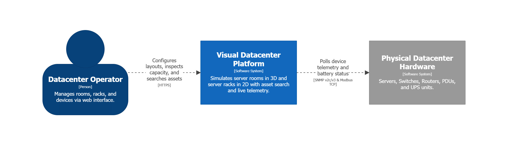
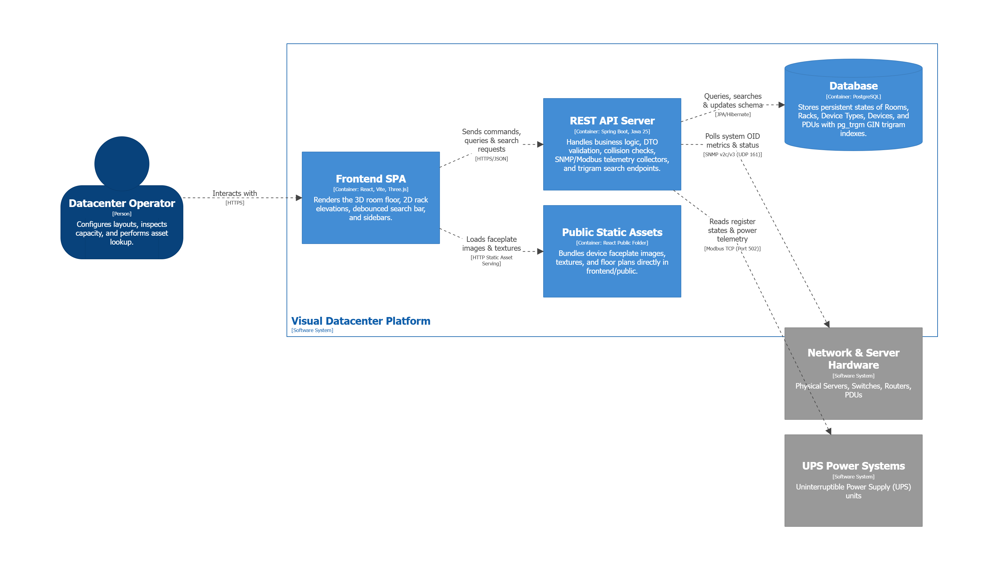
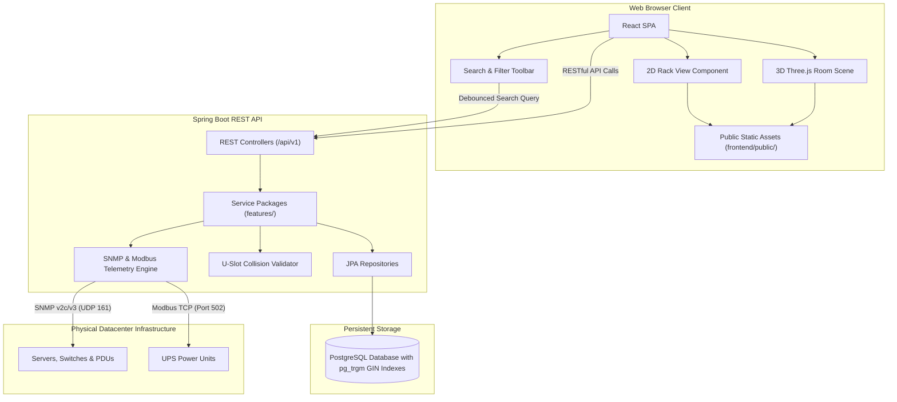
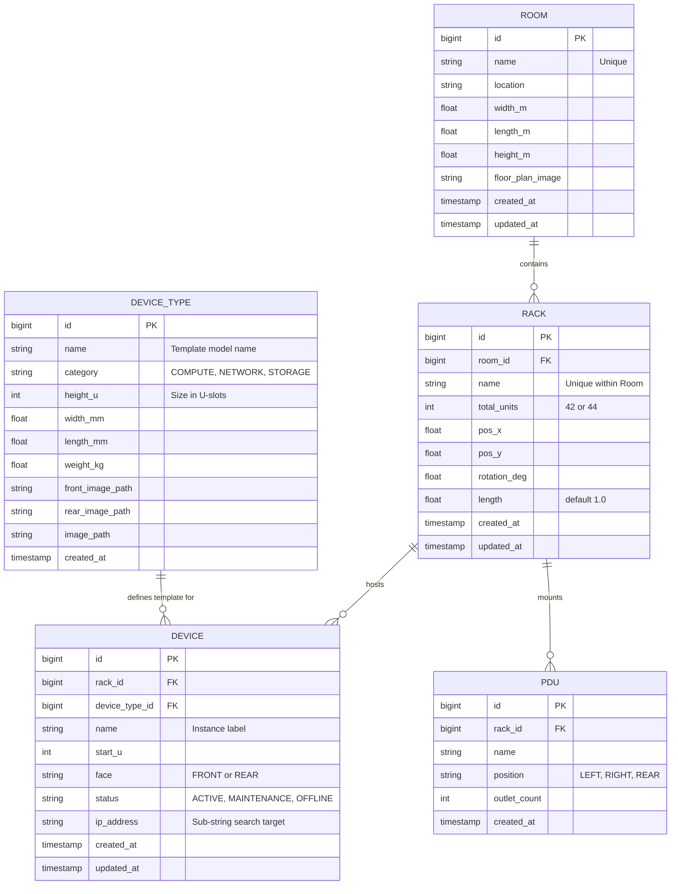
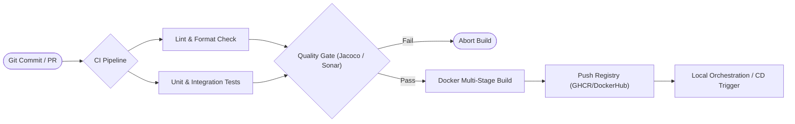

# Visual Datacenter — Technical Design

## 1. Architectural Styles

The system is designed around a **decoupled Client-Server (REST API)** architectural style. 

*   **Frontend SPA**: A single-page React application built with TypeScript, Vite, and TailwindCSS, utilizing Three.js (via React Three Fiber) for 3D room rendering and canvas/DOM elements for 2D rack inspection.
*   **Backend API**: A Spring Boot API (Java 25) acting as a stateless REST service that exposes resources under `/api/v1`.
*   **Stateless REST Communication**: Data transfer occurs via JSON payloads. The backend is the authoritative source of validation and state management.
*   **Sandbox Model**: The initial system operates as a single-user sandbox without authentication or role-based access control, allowing rapid iteration of visual tools.

---

## 2. C4 Diagrams

### Level 1 — System Context

The system context diagram shows the user (Datacenter Operations Manager/Systems Engineer) interacting with the Visual Datacenter platform and external physical equipment.

<!-- ```mermaid
C4Context
    title System Context (Level 1) — Visual Datacenter

    Person(user, "Datacenter Operator", "Manages rooms, racks, and devices via web interface.")
    System(vdc, "Visual Datacenter Platform", "Simulates server rooms in 3D and server racks in 2D with asset search and live telemetry.")
    System_Ext(hw, "Physical Datacenter Hardware", "Servers, Switches, Routers, PDUs, and UPS units.")

    Rel(user, vdc, "Configures layouts, inspects capacity, and searches assets", "HTTPS")
    Rel(vdc, hw, "Polls device telemetry and battery status", "SNMP v2c/v3 & Modbus TCP")
``` -->

### Level 2 — Containers

The container diagram outlines the division between the React Frontend SPA, the Spring Boot Backend API, the PostgreSQL database, frontend static assets, the mock hardware servers, and the local observability stack.

<!-- ```mermaid
C4Container
    title Container Diagram (Level 2) — Visual Datacenter

    Person(user, "Datacenter Operator", "Configures layouts, inspects capacity, and performs asset lookup.")

    System_Boundary(vdc_boundary, "Visual Datacenter Boundary") {
        Container(web_app, "Frontend SPA", "React, Vite, Three.js", "Renders the 3D room floor, 2D rack elevations, debounced search bar, and sidebars.")
        Container(api_server, "REST API Server", "Spring Boot, Java 21", "Handles business logic, DTO validation, collision checks, SNMP/Modbus telemetry collectors, and trigram search endpoints.")
        ContainerDb(database, "Database", "PostgreSQL", "Stores persistent states of Rooms, Racks, Device Types, Devices, and PDUs with pg_trgm GIN trigram indexes.")
        Container(static_assets, "Public Static Assets", "React Public Folder", "Bundles device faceplate images, textures, and floor plans directly in frontend/public.")
        
        Container(prom, "Prometheus", "Prometheus TSDB", "Scrapes metrics from spring actuator /api/metrics and system endpoints.")
        Container(loki, "Grafana Loki", "Loki Log Store", "Aggregates logs forwarded by Promtail from docker container logs.")
        Container(tempo, "Grafana Tempo", "Tempo Trace Store", "Ingests OTLP traces from the backend JVM for request tracing.")
        Container(promtail, "Promtail", "Loki Agent", "Shipper reading docker log files and pushing them to Loki.")
        Container(grafana, "Grafana", "Data Visualization Dashboard", "Queries Prometheus, Loki, and Tempo to render observability dashboards.")
    }

    System_Ext(snmp_devices, "Network & Server Hardware (Mock)", "Python SNMP server simulating dynamic metrics on UDP 161")
    System_Ext(modbus_ups, "UPS Power Systems (Mock)", "Python Modbus TCP server simulating battery telemetry on Port 502")

    Rel(user, web_app, "Interacts with", "HTTPS")
    Rel(web_app, api_server, "Sends commands, queries & search requests", "HTTPS/JSON")
    Rel(web_app, static_assets, "Loads faceplate images & textures", "HTTP Static Asset Serving")
    Rel(api_server, database, "Queries, searches & updates schema", "JPA/Hibernate")
    Rel(api_server, snmp_devices, "Polls system OID metrics & status", "SNMP v2c/v3 (UDP 161)")
    Rel(api_server, modbus_ups, "Reads register states & power telemetry", "Modbus TCP (Port 502)")
    
    Rel(promtail, loki, "Pushes aggregated container logs", "HTTP")
    Rel(api_server, tempo, "Exports application traces", "OTLP/gRPC 4317")
    Rel(prom, api_server, "Scrapes metrics from /actuator/prometheus", "HTTP")
    Rel(grafana, prom, "Queries metrics", "HTTP")
    Rel(grafana, loki, "Queries logs", "HTTP")
    Rel(grafana, tempo, "Queries traces", "HTTP")
``` -->

---

## 3. High-Level Architecture

The components flow from the browser interfaces to the Spring Boot feature packages, the database, and physical hardware equipment:


```mermaid
flowchart TB
    subgraph Browser ["Web Browser Client"]
        spa["React SPA"]
        rack2d["2D Rack View Component"]
        room3d["3D Three.js Room Scene"]
        searchBar["Search & Filter Toolbar"]
        assets["Public Static Assets (frontend/public/)"]
    end

    subgraph Backend ["Spring Boot REST API"]
        ctrl["REST Controllers (/api/v1)"]
        svc["Service Packages (features/)"]
        telemetry["SNMP & Modbus Telemetry Engine"]
        valid["U-Slot Collision Validator"]
        repo["JPA Repositories"]
    end

    subgraph Storage ["Persistent Storage"]
        db[("PostgreSQL Database with pg_trgm GIN Indexes")]
    end

    subgraph Hardware ["Physical Datacenter Infrastructure"]
        snmpDev["Servers, Switches & PDUs"]
        modbusUps["UPS Power Units"]
    end

    spa --> rack2d
    spa --> room3d
    spa --> searchBar
    rack2d --> assets
    room3d --> assets
    searchBar -- "Debounced Search Query" --> ctrl
    spa -- "RESTful API Calls" --> ctrl
    ctrl --> svc
    svc --> telemetry
    svc --> valid
    svc --> repo
    repo --> db
    telemetry -- "SNMP v2c/v3 (UDP 161)" --> snmpDev
    telemetry -- "Modbus TCP (Port 502)" --> modbusUps
```

---

## 4. Database Schema Logic

### Entity Relationship Diagram (ERD)

The database schema defines the relationships between rooms, racks, devices, PDUs, and device types.


```mermaid
erDiagram
    ROOM ||--o{ RACK : contains
    RACK ||--o{ DEVICE : "hosts"
    RACK ||--o{ PDU : "mounts"
    DEVICE_TYPE ||--o{ DEVICE : "defines template for"

    ROOM {
        bigint id PK
        string name "Unique"
        string location
        float width_m
        float length_m
        float height_m
        string floor_plan_image
        timestamp created_at
        timestamp updated_at
    }

    RACK {
        bigint id PK
        bigint room_id FK
        string name "Unique within Room"
        int total_units "42 or 44"
        float pos_x
        float pos_y
        float rotation_deg
        float length "default 1.0"
        timestamp created_at
        timestamp updated_at
    }

    DEVICE_TYPE {
        bigint id PK
        string name "Template model name"
        string category "COMPUTE, NETWORK, STORAGE"
        int height_u "Size in U-slots"
        float width_mm
        float length_mm
        float weight_kg
        string front_image_path
        string rear_image_path
        string image_path
        timestamp created_at
    }

    DEVICE {
        bigint id PK
        bigint rack_id FK
        bigint device_type_id FK
        string name "Instance label"
        int start_u
        string face "FRONT or REAR"
        string status "ACTIVE, MAINTENANCE, OFFLINE"
        string ip_address "Sub-string search target"
        timestamp created_at
        timestamp updated_at
    }

    PDU {
        bigint id PK
        bigint rack_id FK
        string name
        string position "LEFT, RIGHT, REAR"
        int outlet_count
        timestamp created_at
    }
```

### Core Invariants

| Entity | Core Validation Rules & Invariants |
| :--- | :--- |
| **Room** | `width_m > 0`, `length_m > 0`; System-wide unique name. |
| **Rack** | `total_units` ∈ {42, 44}; Coordinates `pos_x` and `pos_y` must be within Room boundaries; Unique name within Room. Color-coded in 3D based on U-slot utilization (High ≥80% Red, Medium ≥50% Yellow, Low <50% Green) across standard, selected highlight, and X-ray mode outer-frame states. |
| **Device** | `start_u >= 1` and `start_u + device_type.height_u - 1 <= rack.total_units`. Overlap validation (U-slot collision detection). |
| **PDU** | `position` ∈ {LEFT, RIGHT, REAR}; maximum 3 PDUs attached to a single rack (one per position). |
| **Device Type** | `height_u >= 1`, width and length positive; deletion blocked if referenced by active device instances. |

### U-Slot Collision Detection Logic

Before persisting any device installation, the service layer enforces the following transactional logic:

1.  **Define Target Interval**: A device of height $H$ installed at start unit $S$ occupies slots:
    $$I_{target} = [S, S + H - 1]$$
2.  **Fetch Existing Intervals**: Query all devices currently installed in the same rack ID where `face` matches the target installation face (e.g. `FRONT` or `REAR`).
3.  **Conflict Check**: For each existing device with interval $I_{existing} = [E_{start}, E_{start} + E_{height} - 1]$:
    $$\text{Conflict} \iff I_{target} \cap I_{existing} \neq \emptyset$$
    $$\text{Conflict} \iff \max(S, E_{start}) \le \min(S + H - 1, E_{start} + E_{height} - 1)$$
4.  **Action**: If a conflict is detected, abort the transaction and return HTTP 409 Conflict. If no conflicts exist, proceed with persistence.

---

## 5. Architecture Decision Records (ADRs)

| ADR # | Decision | Context / Rationale | Consequences |
| :--- | :--- | :--- | :--- |
| **ADR-01** | Decoupled Spring Boot + React | Separates business domain logic from visualization and client-side interactions. | Clean API contract; separate build steps. |
| **ADR-02** | Three.js for 3D Room View | High performance, rich WebGL libraries, and robust OrbitControls / raycasting support. | High dependency on browser WebGL support. |
| **ADR-03** | Instanced Mesh for 10k+ Devices | To maintain FPS > 40, rendering individual unique BoxGeometries for thousands of devices causes draw-call bottlenecks. Instanced meshes share geometry and materials, executing in a single draw-call. | Requires centralizing mesh updates and tracking instance index offsets. |
| **ADR-04** | Authoritative Server-side Collision | Client-side layout tools are optimistic for speed, but the database integrity relies on Spring Boot's service validations. | Slightly higher API overhead during device installation. |
| **ADR-05** | No Authentication in MVP | Allows zero-friction sandbox usage. | Security checks and login screens must be implemented in a subsequent deployment phase. |
| **ADR-06** | Frontend Public Asset Bundling | Serve faceplate and texture images directly from the React static public directory (`frontend/public/`). | Eliminates backend file I/O overhead and complex file upload handling; assets are bundled with the web client. |
| **ADR-07** | Dual-Face (Front/Rear) Texture Mapping | 3D device materials map to front face, rear face and while 2D rack elevation renders the active faceplate. | Ensures accurate hardware visualization regardless of installation orientation. |
| **ADR-08** | Loki, Tempo, and Promtail for Observability | Rather than using Jaeger, we utilize Loki (log aggregation), Tempo (distributed traces), and Promtail (log collection agent) integrated with Prometheus and Grafana for full observability. | Centralized monitoring stack using standard Grafana agents. |
| **ADR-09** | SSE In-Memory Caching for Telemetry | To avoid sub-second latency delays during subscription, the controllers maintain thread-safe cache logs. Connecting clients receive the baseline immediately without waiting for the 5s scheduler. | Clients receive instant, responsive telemetry data on connection (<10ms). |

---

## 6. CI/CD Pipeline Design

The system implements automated builds, testing, and container packaging using a unified GitHub Actions pipeline.


```mermaid
flowchart LR
    Start([Git Commit / PR]) --> Trigger{CI Pipeline}
    Trigger --> Lint["Lint & Format Check"]
    Trigger --> Test["Unit & Integration Tests"]
    Lint & Test --> Quality{"Quality Gate (Jacoco / Sonar)"}
    Quality -- Fail --> Terminate([Abort Build])
    Quality -- Pass --> Dockerize["Docker Multi-Stage Build"]
    Dockerize --> Push["Push Registry (GHCR/DockerHub)"]
    Push --> Deploy["Local Orchestration / CD Trigger"]
```
---

## 7. Quality Gates

To guarantee development speed without sacrificing runtime stability (FPS > 40 under high load), code must pass the following quality thresholds before being merged into `main` or `develop`:

### Static Analysis and Code Rules
*   **0 Blocker / Critical Bugs**: No warning labels or safety issues detected by SonarQube.
*   **Zero Syntax & Linter Errors**: ESLint configurations must be completely clean on the frontend; Checkstyle/Spotless checks must compile warning-free on the backend.
*   **Complexity Thresholds**: Cognitive complexity of React rendering components must remain low; complex 3D computations (like instanced mesh coordinates) must be isolated into helper functions with dedicated unit tests.

### Test Coverage Requirements
*   **Backend Test Coverage**: Minimum **80% line and branch coverage** verified by Jacoco. Focus on validating U-slot collision boundaries and room coordinate validations.

### Container Security
*   **Vulnerability Scan**: Docker images undergo standard automated vulnerability scans using Snyk during the build stage.
